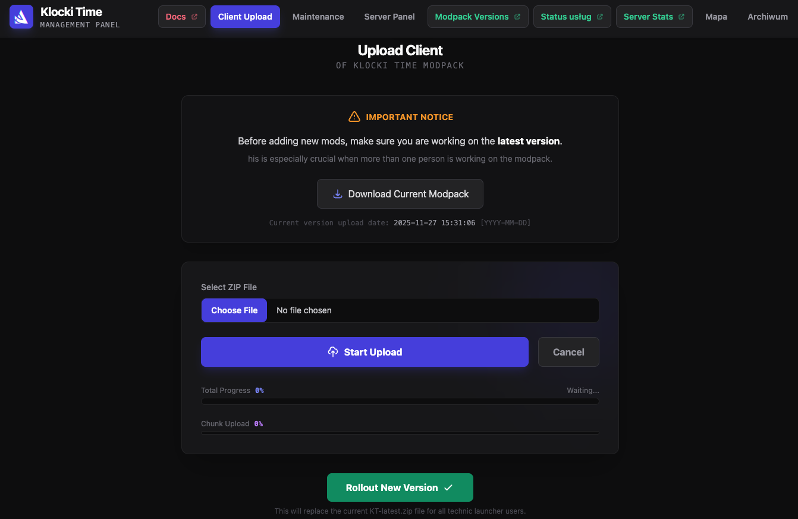
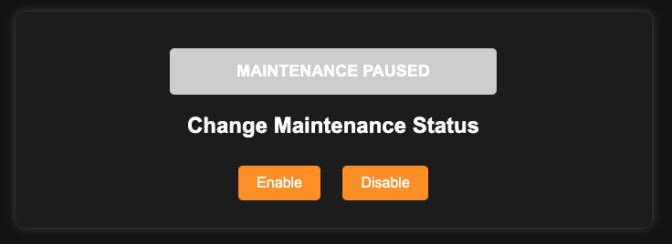

# Project Overview

This project provides a centralized platform integrating multiple services and tools for deployment, monitoring, and access management.

## Features

- **TechnicLauncher Client Pipeline**
  - Upload & rollout module for streamlined distribution

- **Uptime Kuma**
  - Maintenance mode with quick toggle functionality

- **Pterodactyl Panel Integration**
  - Embedded via iframe

- **Dynmap Integration**
  - Embedded via iframe

- **Archive Library**
  - Centralized storage and access to archived resources

---

## Environment

The system is built on the following infrastructure:

- **NGINX**
  - Core web server and routing layer

- **Cloudflared (Reverse Proxy – Access)**
  - Secure external access to services

- **Cloudflared (Reverse Proxy – Modpack Distribution)**
  - Dedicated tunnel for modpack downloads

- **Cloudflare One (Zero Trust)**
  - Access management and authentication layer

- **Pterodactyl Panel**
  - Game server management platform

---

## Documentation

User documentation is available at:  
👉 https://kt-docs.alleria.pl/

---

## Notes

- All services are designed to operate behind secure tunnels.
- Access control is enforced through Zero Trust policies.
- Modular structure allows independent scaling and maintenance.
